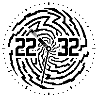
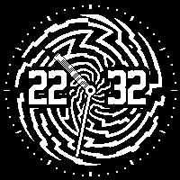

MiteOS  
A Firmware for Watchy
======

Features
-----

✅ Multiple [Watchfaces](#builtin-watchfaces) (from other creators / relatively easy to add your own)  
✅ Timer  
✅ Up to 6 Alarms by default (can be changed to any value when compiling)  
✅ Step Tracking (Remembers the Last 7 days)  
✅ Weather Information (Temperature / Moon Phase) \*/\*\*    
✅ Calendar with Appointment Syncing*  
✅ TOTP Token Storage*  
✅ Check Phone Notifications*  
✅ Media-Playback Info*  
✅ Home Assistant Integration (Lights / Switches) \*/\*\*  
✅ Dark-/Lightmode (Static or Timed)  
✅ Configure Settings through Companion App \*  
✅ 2 configurable Shortcut-Buttons on the Watchface (Top Left and Top Right)  
✅ You can connect to the internet via a cell phone proxy, giving you internet access anywhere \*

\(*) Requires the Phone Companion App (see [Phone Companion](#phone-companion) for Restrictions)  
\(**) Requires a WiFi Connection

**Other Features**  
✅ App-Menu  
✅ NTP Time Syncing  
✅ Vibrate on Hour Change  
✅ Settings Menu on the watch (Still requires some stuff to be done through code or the app) [Check here](docs/Settings.md)  
✅ [Streamlined Interface](docs/Controls.md)  

How to get Started?
-----
Check out the [First Steps](docs/FirstSteps.md)! I hope that helps :)

Disclaimer
-----
I have no idea what im doing, i never really did any micro controller development. Also, I don't have any experience in C++.  
If my code is not following any code conventions, I'm sorry, I tried my best ^^
It still works as it should, so at least that counts i guess.

Planned Features
-----
- Activity Tracking (like running and stuff, based on the amount of steps coming in per second)
- Configurable Night-Mode (save battery at night or if it is not worn)
- Google Health Syncing
- Standarize Watchfaces

Docs
----
- [Overview of Settings](docs/Settings.md)
- [Controls / Navigation](docs/Controls.md)

Phone Companion
-----
App can be found here: [MiteOS-CompanionApp](https://github.com/Adammantium/MiteOS-CompanionApp)

**Restrictions:**
- Only available for Android
- Notifications get only synced every 15 minutes to save battery.
- Syncing is slow and takes a few seconds
- Only the watch can initiate a sync, so no in time notifications  

**On the bright side:**
- Battery Life is still acceptable

Battery-Life
-----

| Battery  | Offline  | Wifi + Phone Connection |
|----------|----------|-------------------------|
| 200mAh   | ~10 days | ~7 days*                |
| 350mAh** | -        | ~10 days*               |

(*) All Tests have been performed with these settings:
- Screen waking up every minute
- 15 minute interval for the phone/notification connection
- 30 minute interval for weather information

(**) Requires a case that can hold that battery  
  
I use a modified version of https://github.com/yik3z/Watchy-CAD/tree/main/CAD/Cases/SlimV5 that allows for a 320mAh battery.

BuiltIn Watchfaces
-----
| Watchface | Creator | Based on |
|-----------|---------|----------|
| [**Miteo**](#miteo) | [Adammantium](https://github.com/Adammantium) | Casio Watch Design |
| [**Binary Hurricane**](#binary-hurricane) | [Adammantium](https://github.com/Adammantium) |
| [**7_SEG**](https://github.com/sqfmi/Watchy/tree/master/examples/WatchFaces/7_SEG) | [SQFMI](https://github.com/sqfmi) |
| [**BTTF**](https://github.com/peerdavid/wos) | [peerdavid](https://github.com/peerdavid) |
| [**Pokemon 2.0**](https://git.klemek.fr/klemek/watchy/src/branch/master/watchfaces/pokemon-2.0) | [Klemek](https://git.klemek.fr/klemek/) |
| [**MacPaint**](https://github.com/sqfmi/Watchy/tree/master/examples/WatchFaces/MacPaint) | [SQFMI](https://github.com/sqfmi) |
| [**Analog**](https://github.com/BenjaminGabel/AnalogWatchFace) | [BenjaminGabel](https://github.com/BenjaminGabel) |
| [**Hobbit Time**](https://github.com/BraininaBowl/Hobbit-Time-for-Watchy) | [BraininaBowl](https://github.com/BraininaBowl) |
| [**Calendar**](https://github.com/uCBill/Calendar_watchy) | [uCBill](https://github.com/uCBill) |
| [**Train**](https://github.com/uCBill/Multi_face_Watchy/blob/main/train.h) | [uCBill](https://github.com/uCBill) | [Bahn](https://github.com/BraininaBowl/Bahn-for-Watchy) by [BraininaBowl](https://github.com/BraininaBowl) |
| [**Tetris 2.0**](https://git.klemek.fr/klemek/watchy/src/branch/master/watchfaces/tetris-2.0) | [Klemek](https://git.klemek.fr/klemek/) |
| [**BadForEye**](https://github.com/mammothroar/watchy/tree/main/watchface/BadForEye) | [mammothroar](https://github.com/mammothroar) |
| [**StarryHorizon**](https://github.com/sqfmi/Watchy/blob/master/examples/WatchFaces/StarryHorizon/StarryHorizon.ino) | [SQFMI](https://github.com/sqfmi) |

All watchfaces have been modified by me to run on this OS. I also added light and darkmode to each of the watchfaces.  
If you are the author of any of these watchfaces and don't want me to distribute them, please contact me and i'll remove them immediatly.

Screenshots
-----
#### Custom Watchfaces
##### Miteo
   
##### Binary Hurricane
   
#### Some Included Watchfaces
   
#### Other Apps
             
